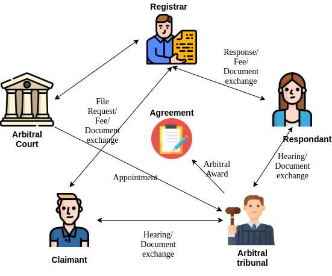
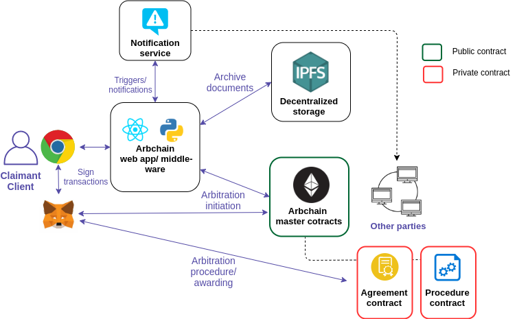

## Entities

The entities and the architecture for the POC is based on the [LCIA](lcia.org) arbitration.

Entities of Arbchain are all the entities involved in the arbitration procedure.
They form the nodes in the Hyperledger Besu network. A few of the default nodes of Arbchain are:

* Arbitral court
* Registrar
* Claimant
* Respondant
* Tribunal

## High level architecture

 
## Solution architecture
The following technical architecture diagram consists of all the protocols and services used by Arbchain. 

### Arbchain actions involve:

* The claimant files the request along with agreement, procedure details

* Claimant submits any documents which will be time stamaped and archived

* Respondant reviews/ signs/ makes further claims

* Respondant submits any documents which will be time stamaped and archived

* Tribunal is formed by the court based on the agreement terms

## Contract architecture

